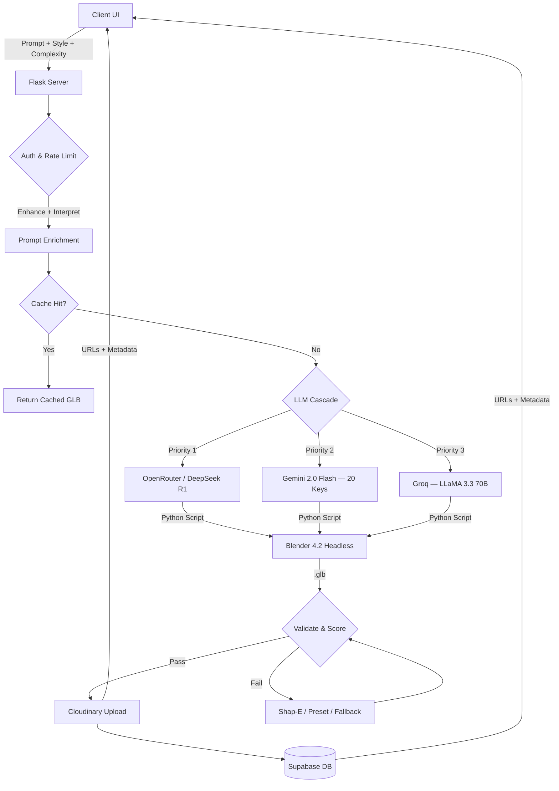

<div align="center">
  

  <br/><br/>

  [](https://python.org)
  [](https://flask.palletsprojects.com/)
  [](https://www.blender.org/)
  [](https://ai.google.dev/)
  [](https://deepseek.com/)
  [](https://supabase.com/)
  [](https://cloudinary.com/)

  <br/>

  **Turn your imagination into production-quality 3D GLB models — from text or images — powered by AI.**

  **Live Demo:** [aurexs3d.up.railway.app/app](https://aurexs3d.up.railway.app/app)

</div>

---

## Overview

Aurex AI 3D Studio is a full-stack 3D model generation platform. You describe what you want in natural language (or upload a reference image), and the system orchestrates a multi-stage AI pipeline — prompt enrichment, LLM-driven Blender script generation, headless rendering, cloud upload, and metadata persistence — to deliver a downloadable `.glb` model in seconds.

The entire experience runs in the browser with a Three.js-powered interactive 3D viewer, optional **hand gesture controls** via MediaPipe, **multi-variant parallel generation**, a **community gallery**, and first-class **Google OAuth** user sessions.

---

## Feature Highlights

### AI & Generation

| Feature | Description |
|---|---|
| **Multi-Provider LLM Cascade** | OpenRouter (DeepSeek R1 reasoning model) **→** Google Gemini 2.0 Flash (20-key rotation) **→** Groq (LLaMA 3.3 70B). Automatic failover across all three. |
| **AI Prompt Enhancer** | Expands short prompts into rich, 3D-ready descriptions with structural, material, and part-naming hints before generation. |
| **Image-to-3D** | Upload JPG/PNG/WebP — Gemini Vision extracts a text description, then the full pipeline generates the model. |
| **Multi-Variant Generation** | Creates **3 parallel interpretations** (original, top-down emphasis, stylized proportions) — pick the best with keyboard or click. |
| **5-Stage Fallback Pipeline** | Cache → Gemini+Blender → Shap-E → Preset Library (54 keywords) → Pure-Python GLB Builder (55 shapes). **Never returns empty.** |
| **Blender Headless Rendering** | LLM generates a complete Python script; Blender 4.2 executes it headlessly to produce a validated `.glb`. |
| **Style & Complexity Controls** | Choose from style directives (realistic, cartoon, low-poly, etc.) and complexity levels 1–5. |
| **Live Pipeline Visualizer** | Real-time progress bar with named stages: Enhance → LLM Script → Blender → Upload → Done, plus ETA during Blender execution. |
| **Live Blender Script Preview** | Expand "View Script" during generation to see the AI-written Python code in real time. |

### Interaction & Viewer

| Feature | Description |
|---|---|
| **Three.js GLB Viewer** | Interactive orbit/pan/zoom with mouse and touch. |
| **Hand Gesture Control** | MediaPipe-powered — open palm orbits, fist pans, pinch zooms, peace sign cycles parts, pointing resets camera. One Euro filter for silky-smooth tracking. |
| **Part-Level Focus** | Gesture engine can isolate and highlight individual named Blender objects within a model. |
| **Inertia & Momentum** | Gestures carry momentum after release for natural-feeling interaction. |

### Cloud & Persistence

| Feature | Description |
|---|---|
| **Google OAuth 2.0** | Secure sign-in with per-user isolated data. Guest mode available as fallback. |
| **Cloudinary CDN** | Every generated GLB is auto-uploaded for global delivery with signed uploads. |
| **Supabase Postgres** | Per-user model history, folder CRUD, and community gallery data — all via REST API. |
| **Share Links** | Public `/share/<model_id>` viewer pages with embedded Three.js. |
| **Export Formats** | Download as GLB, or convert to OBJ/FBX via headless Blender on-the-fly. |
| **Folder Organization** | Create, rename, and delete folders to organize your model library. |

### Infrastructure

| Feature | Description |
|---|---|
| **Smart Key Rotation** | LRU selection, 3-strike dead marking, 401/403 permanent kill, background resurrection thread (configurable interval). |
| **Rate Limiting** | 10 requests/minute per IP on the `/generate` endpoint. |
| **Caching** | Prompt+color hash-based GLB cache with automatic size-based cleanup. |
| **GLB Validation** | Magic byte check, minimum size enforcement, and quality scoring (mesh/primitive/vertex/node counts). |
| **Background Quality Repair** | Post-generation thread applies Blender-based quality fixes automatically. |
| **PWA Support** | Web app manifest for installable experience on mobile and desktop. |
| **Request Logging** | Per-request timing, structured server/generation/error log files. |
| **API Keys (Demo)** | `aurex_`-prefixed demo API keys for external integrations. |

---

## Architecture

```
User Prompt / Image
        │
        ▼
┌───────────────────────────────────────────────────────────┐
│  FLASK SERVER  (server.py — 7,500 lines)                  │
│                                                           │
│  ┌─────────────┐   ┌──────────────┐   ┌──────────────┐   │
│  │  Enhance &   │──▶│  LLM Cascade │──▶│   Blender    │   │
│  │  Interpret   │   │  OR → Gem → G│   │   Headless   │   │
│  └─────────────┘   └──────────────┘   └──────┬───────┘   │
│         │                                     │           │
│         │  ┌──────────┐  ┌──────────────┐     │           │
│         └─▶│ Shap-E   │  │ 54 Presets + │◀────┘           │
│            │ (opt.)   │  │ 55 Shapes   │  (fallbacks)     │
│            └──────────┘  └──────────────┘                 │
│                              │                            │
│                              ▼                            │
│                    ┌──────────────────┐                    │
│                    │  Validate + Score │                   │
│                    └────────┬─────────┘                    │
│                             │                             │
│              ┌──────────────┼──────────────┐              │
│              ▼              ▼              ▼              │
│     ┌──────────────┐ ┌───────────┐ ┌──────────────┐      │
│     │  Cloudinary  │ │ Supabase  │ │  Local Cache  │      │
│     │  CDN Upload  │ │  History  │ │  (hash-keyed) │      │
│     └──────────────┘ └───────────┘ └──────────────┘      │
└───────────────────────────────────────────────────────────┘
        │
        ▼
┌───────────────────────────────────────────────────────────┐
│  BROWSER CLIENT  (static/index.html — single-page app)    │
│                                                           │
│  Three.js Viewer ← gesture-engine.js (MediaPipe Hands)    │
│  Pipeline Visualizer │ Variant Selector │ Community Gallery│
└───────────────────────────────────────────────────────────┘
```



---

## Quick Start (Local Development)

### Prerequisites

| Requirement | Version | Notes |
|---|---|---|
| **Python** | 3.10+ | With pip |
| **Blender** | 4.0+ | Default install path on Windows (`C:\Program Files\Blender Foundation\...`) |

### 1. Clone & Install

```bash
git clone https://github.com/your-username/ai-3d-studio.git
cd ai-3d-studio
pip install -r requirements.txt
```

### 2. Configure Environment

Copy the example settings file for local development:

```bash
cp settings.example.json settings.json
```

Then populate your API keys. Alternatively, export them as environment variables (names are **case-insensitive**):

| Variable | Purpose | Range |
|---|---|---|
| `SECRET_KEY` | Flask session encryption | **Required** |
| `OPENROUTER_KEY_1`…`10` | OpenRouter API access (DeepSeek R1 + others) | Up to 10 keys |
| `GEMINI_KEY_1`…`20` | Google Gemini 2.0 Flash | Up to 20 keys with auto-rotation |
| `GROQ_KEY_1`…`10` | Groq (LLaMA 3.3 70B fallback) | Up to 10 keys |
| `CLOUDINARY_CLOUD_NAME` | Cloudinary cloud name | |
| `CLOUDINARY_API_KEY` | Cloudinary API key | |
| `CLOUDINARY_API_SECRET` | Cloudinary API secret | |
| `SUPABASE_URL` | Supabase project URL | |
| `SUPABASE_ANON_KEY` | Supabase anonymous/service key | |
| `GOOGLE_CLIENT_ID` | Google OAuth 2.0 client ID | Optional — falls back to guest mode |
| `GOOGLE_CLIENT_SECRET` | Google OAuth 2.0 client secret | Optional |

### 3. Database Setup (Supabase)

Create a project at [supabase.com](https://supabase.com) and run this SQL:

```sql
-- Model history
CREATE TABLE models (
    id          BIGINT PRIMARY KEY,
    user_id     TEXT NOT NULL,
    prompt      TEXT,
    color       TEXT,
    folder      TEXT,
    service     TEXT,
    file        TEXT,
    cloud_url   TEXT,
    created_at  TIMESTAMPTZ DEFAULT NOW(),
    size        BIGINT,
    quality_score NUMERIC
);
CREATE INDEX idx_models_user ON models(user_id);

-- Per-user folders
CREATE TABLE user_folders (
    id          BIGSERIAL PRIMARY KEY,
    user_id     TEXT NOT NULL,
    name        TEXT NOT NULL,
    created_at  TIMESTAMPTZ DEFAULT NOW(),
    UNIQUE(user_id, name)
);
```

### 4. Run

```bash
python server.py
```

Open **http://127.0.0.1:5000** — you'll see the animated login page. Sign in with Google or continue as guest at `/app`.

---

## API Reference (Partial)

<details>
<summary><strong>Click to expand — 60+ endpoints</strong></summary>

### Core Generation

| Method | Endpoint | Description |
|---|---|---|
| `POST` | `/generate` | Start a generation. Body: `prompt`, `color`, `folder`, `style`, `complexity`, `is_edit`, etc. |
| `GET` | `/status` | Poll current generation state (progress %, step name, GLB URL). |
| `POST` | `/generate_variants` | Generate 3 parallel variants. Returns `job_id`. |
| `GET` | `/variants/<job_id>` | Poll variant generation status and results. |
| `POST` | `/api/enhance_prompt` | Preview prompt enhancement without generating. |
| `POST` | `/api/image_to_prompt` | Upload an image → get a text description + enhanced prompt. |
| `GET` | `/api/blender_script` | Retrieve the latest generated Blender Python script. |

### Models & History

| Method | Endpoint | Description |
|---|---|---|
| `GET` | `/rocket.glb` | Serve the current model (redirects to cloud URL if available). |
| `GET` | `/models/<path>` | Serve model files with path traversal protection. |
| `GET` | `/download` | Download current model as attachment. |
| `GET` | `/export/obj` or `/export/fbx` | Convert current GLB to OBJ or FBX via Blender. |
| `POST` | `/save` | Save current model to user storage + Supabase. |
| `GET` | `/history` | Get user's model history. |
| `POST` | `/delete_model` | Delete a model from history. |
| `GET` | `/share/<model_id>` | Public share viewer page. |
| `GET` | `/api/community` | Community gallery — latest 50 public models. |

### Folders

| Method | Endpoint | Description |
|---|---|---|
| `GET` | `/folders` | Get folder list. |
| `POST` | `/folders` | Create a new folder. |
| `DELETE` | `/folders/<name>` | Delete a folder. |
| `POST` | `/api/folders/rename` | Rename a folder. |

### Auth

| Method | Endpoint | Description |
|---|---|---|
| `GET` | `/auth/google` | Initiate Google OAuth flow. |
| `GET` | `/auth/callback` | OAuth callback handler. |
| `GET` | `/auth/logout` | Clear session and redirect to login. |
| `GET` | `/auth/me` | Get current user info. |
| `POST` | `/guest` | Create a guest session. |

### System & Diagnostics

| Method | Endpoint | Description |
|---|---|---|
| `GET` | `/ping` | Health check with key status, cache stats, Blender availability. |
| `GET` | `/health` | Railway/Render health check (returns `"healthy"`). |
| `GET` | `/api/version` | Version info. |
| `GET` | `/api/system_info` | Comprehensive system diagnostics. |
| `GET` | `/api/gemini/status` | Gemini key health (alive/dead counts). |
| `GET` | `/api/keys/status` | All provider key status (OpenRouter, Gemini, Groq). |
| `GET` | `/api/stats` | Generation statistics. |
| `GET` | `/api/cache/info` | Cache size and entry count. |
| `POST` | `/api/blender/test` | Test Blender installation. |
| `POST` | `/api/gemini/test` | Test a Gemini API call. |
| `POST` | `/api/llm/test` | Test the unified LLM cascade. |
| `POST` | `/api/cloudinary/test` | Test Cloudinary upload. |

</details>

---

## Deployment

> **Important:** Do not deploy to Vercel or similar serverless platforms. Flask + Blender require a long-running Docker web service.

### Railway (Recommended)

1. Push your repo to GitHub.
2. Connect the repo to a new Railway project — it auto-detects the `Dockerfile`.
3. Add all environment variables in Railway's **Variables** tab.
4. Railway builds the Docker image (downloads Blender 4.2 — takes ~5 min).
5. The app starts via `gunicorn --bind 0.0.0.0:$PORT --timeout 300 --workers $WEB_CONCURRENCY wsgi:app`.
6. Generate a domain in **Settings → Networking**.

### Render (Docker)

1. Push repo to GitHub.
2. Create a **New Web Service** → choose **Docker**.
3. Add environment variables.
4. Set start command: `gunicorn --bind 0.0.0.0:8080 --timeout 300 --workers 1 wsgi:app`.

For a detailed step-by-step walkthrough (including Git setup for beginners), see [`DEPLOY_GUIDE.txt`](DEPLOY_GUIDE.txt).

---

## Repository Layout

See [`PROJECT_STRUCTURE.md`](PROJECT_STRUCTURE.md) for the full file manifest and runtime policy.

```
ai-3d-studio/
├── server.py                 # Flask backend — 7,500 lines, entire pipeline
├── generate_model.py         # Pure-Python GLB fallback builder (55 shapes)
├── wsgi.py                   # Gunicorn WSGI entry point
├── static/
│   ├── index.html            # Single-page app (Three.js viewer + full UI)
│   ├── login.html            # Animated login/landing page
│   ├── gesture-engine.js     # MediaPipe hand gesture controller (v2)
│   └── logo.png              # App logo
├── Dockerfile                # Docker build (Python 3.11 + Blender 4.2)
├── Procfile                  # Heroku/Railway process declaration
├── requirements.txt          # Python dependencies
├── railway.json              # Railway build configuration
├── nixpacks.toml             # Nixpacks build hints
├── settings.example.json     # Local config template
├── DEPLOY_GUIDE.txt          # Beginner-friendly deployment walkthrough
├── PROJECT_STRUCTURE.md      # File manifest and runtime policy
├── USAGE.md                  # End-user guide
└── README.md                 # This file
```

---

## How to Use

See [`USAGE.md`](USAGE.md) for a complete product-style guide covering:

- Prompting strategies for best results
- Viewer controls (mouse, touch, keyboard)
- Hand gesture reference
- Image-to-3D workflow
- Multi-variant generation
- History, folders, sharing, and export

---

## What's New in V8.0 (Final Production Release)

- **Investor-Grade UI/UX** — Ultra-premium glassmorphism, Aurora backgrounds, and refined micro-animations.
- **DeepSeek R1 Reasoning Model** — Primary LLM via OpenRouter with `<think>` block stripping for clean script output.
- **AI Prompt Enhancer** — Automatic structural, material, and complexity hints injected before generation.
- **Image-to-3D** — Gemini Vision analyzes reference photos and converts them to modeling prompts.
- **Multi-Variant Generation** — 3 parallel interpretations with mini-viewer cards and keyboard selection.
- **Public Community Gallery** — Browse recent creations from all users at `/api/community`.
- **Live Pipeline Visualizer** — Real-time stage progress with ETA during Blender execution.
- **Hand Gesture Engine v2** — Ultra-smooth One Euro filter, momentum/inertia, premium HUD, part-level focus, and two-hand zoom.
- **Per-User Supabase Isolation** — History and folders are fully scoped to authenticated users.
- **Background Quality Repair** — Post-generation Blender pass to fix common mesh issues.
- **Smart Key Resurrection** — Background thread periodically revives transiently-failed API keys.

---

## Tech Stack

| Layer | Technology |
|---|---|
| **Backend** | Python 3.11 / Flask 3.0 / Gunicorn |
| **3D Rendering** | Blender 4.2 (headless via subprocess) |
| **AI Models** | DeepSeek R1, Gemini 2.0 Flash, LLaMA 3.3 70B |
| **AI Providers** | OpenRouter, Google AI, Groq |
| **Frontend** | Vanilla HTML/CSS/JS, Three.js (GLB viewer) |
| **Hand Tracking** | MediaPipe Hands + Aurex Custom Gesture Engine v2 |
| **Database** | Supabase (PostgreSQL via REST API) |
| **CDN** | Cloudinary (signed raw uploads) |
| **Auth** | Google OAuth 2.0 (JWT decode) |
| **Deployment** | Docker, Railway, Render |
| **Fallback** | Pure-Python GLB builder (zero dependencies) |

---

## License

This project is provided as-is for educational and personal use.

---

<div align="center">
  <sub>Built with obsessive attention to detail for 3D enthusiasts everywhere.</sub>
  <br/>
  <sub>Aurex AI 3D Studio V8.0 Final — <em>From words to worlds.</em></sub>
</div>

