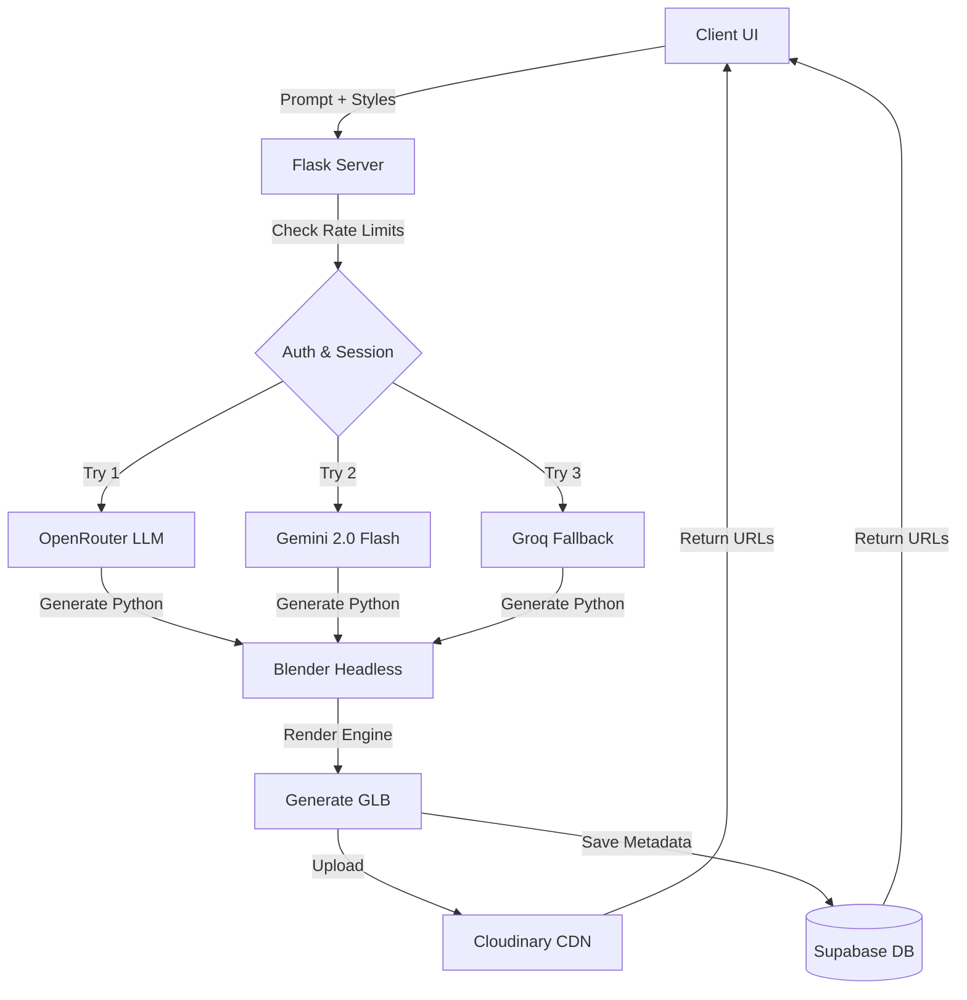

<div align="center">
  
  <h1>🌌 Aurex AI 3D Studio (V8.0)</h1>
  <p><strong>Next-Generation Text-to-3D Generation Pipeline</strong></p>
  <p><strong>Live Demo:</strong> <a href="https://aurex-3d.up.railway.app">https://aurex-3d.up.railway.app</a></p>
  
  [](https://python.org)
  [](https://flask.palletsprojects.com/)
  [](https://ai.google.dev/)
  [](https://supabase.com/)

  *Turn your imagination into high-quality 3D models using AI.*
</div>

---

## ✨ Features

- 🧠 **Multi-API Intelligence**: Powered primarily by OpenRouter, with robust failovers to **Google Gemini (20 Keys Auto-Rotation)** and Groq.
- 🎨 **Hybrid Pipeline**: LLM generates optimized Python scripts which are seamlessly executed by a headless Blender instance.
- ☁️ **Cloud Native**: Integrated automatically with **Cloudinary** for global GLB delivery and **Supabase** for scalable, user-specific model history storage.
- 🔐 **Google Authentication**: Built-in Google OAuth2 for secure user sessions and personalized model libraries.
- ⚡ **Production Ready**: Configured for Railway deployment via Gunicorn.

---

## What's New in V8

- **AI Prompt Enhancer** expands short prompts into richer 3D-ready descriptions before generation.
- **Image-to-3D** turns JPG, PNG, or WebP reference images into modeling prompts with a vision LLM.
- **Multi-Variant Generation** creates three interpretations of a prompt in parallel and lets users choose the best result.
- **Public Community Gallery** shows recent creations across users with anonymized creator details.
- **Live Pipeline Visualizer** displays Enhance, LLM Script, Blender, Upload, and Done stages during generation.

---

## 🏗️ Architecture

Aurex takes a user's text prompt or reference image, enriches it with an LLM, asks another LLM to write a Blender Python scene script, runs that script in headless Blender to build a GLB model, uploads the finished GLB to Cloudinary, and stores searchable metadata in Supabase so users can reload, download, share, and export their creations.



---

## 🚀 Quick Start (Local Setup)

### 1. Prerequisites
- **Python 3.10+** installed.
- **Blender 4.0+** installed in its default `C:\Program Files` directory (Windows).

### 2. Installation
```bash
git clone https://github.com/your-repo/ai-3d-project.git
cd ai-3d-project
pip install -r requirements.txt
```

### 3. Environment Variables
You need to set up your API keys. Locally, copy `settings.example.json` to an untracked `settings.json`, or export environment variables. In production, add them to the service Variables tab.

*Note: Variable names are **case-insensitive***.
- `OPENROUTER_KEY_1` to `OPENROUTER_KEY_10`
- `GEMINI_KEY_1` to `GEMINI_KEY_20`
- `GROQ_KEY_1` to `GROQ_KEY_10`

### 4. Database Setup (Supabase)
To enable scalable storage:
1. Create a project on [Supabase.com](https://supabase.com/).
2. Add `SUPABASE_URL` and `SUPABASE_ANON_KEY` to your environment variables.
3. Run the following SQL in your Supabase SQL Editor:
```sql
create table models (
    id bigint primary key,
    user_id text not null,
    prompt text,
    color text,
    folder text,
    service text,
    file text,
    cloud_url text,
    created text,
    size bigint,
    quality_score numeric
);
create index idx_models_user on models(user_id);
```

### 5. Run the Studio!
```bash
python server.py
```
Visit `http://127.0.0.1:5000` in your browser.

---

## Repository Layout

The repo root is kept focused on deployable source: `server.py`, `wsgi.py`, `static/index.html`, deployment files, and docs. Runtime output such as `logs/`, `storage/`, `rocket.glb`, `history*.json`, `state.json`, and generated `models/**/*.glb` is ignored and recreated by the app as needed. See `PROJECT_STRUCTURE.md` for the full policy.

---

## ☁️ Deployment (Render or Railway)

Do not deploy this app to Vercel. Flask and Blender require a long-running Docker web service.

Render Docker deployment:
1. Push the cleaned repository to GitHub.
2. In Render, create a New Web Service and choose Docker.
3. Add all environment variables from the setup section.
4. Set the start command to `gunicorn --bind 0.0.0.0:8080 --timeout 300 --workers 1 wsgi:app`.

Railway deployment:
1. Connect your GitHub repository to Railway.
2. Railway will automatically detect the `Dockerfile`.
3. Go to the **Variables** tab in Railway and add your API keys (e.g., `gemini_key_1`, `supabase_url`, `google_client_id`).
4. The server will start automatically via `gunicorn`.

---
<div align="center">
  <i>Developed with ❤️ for 3D enthusiasts.</i>
</div>
