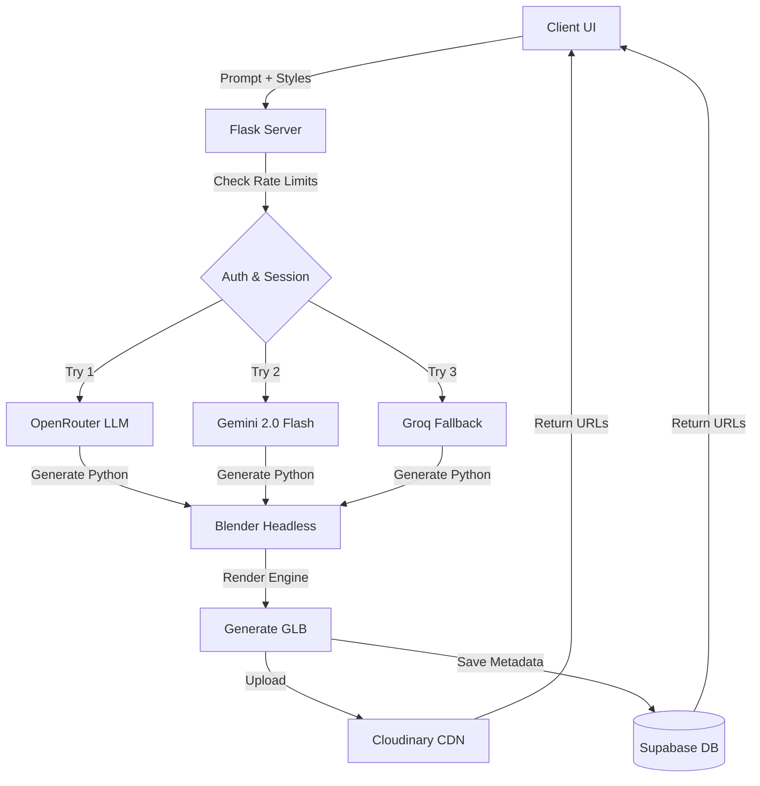

<div align="center">
  
  <h1>🌌 Aurex AI 3D Studio (V7.0)</h1>
  <p><strong>Next-Generation Text-to-3D Generation Pipeline</strong></p>
  
  [](https://python.org)
  [](https://flask.palletsprojects.com/)
  [](https://ai.google.dev/)
  [](https://supabase.com/)

  *Turn your imagination into high-quality 3D models using AI.*
</div>

---

## ✨ Features

- 🧠 **Multi-API Intelligence**: Powered primarily by OpenRouter, with robust failovers to **Google Gemini (20 Keys Auto-Rotation)** and Groq.
- 🎨 **Hybrid Pipeline**: LLM generates optimized Python scripts which are seamlessly executed by a headless Blender instance.
- ☁️ **Cloud Native**: Integrated automatically with **Cloudinary** for global GLB delivery and **Supabase** for scalable, user-specific model history storage.
- 🔐 **Google Authentication**: Built-in Google OAuth2 for secure user sessions and personalized model libraries.
- ⚡ **Production Ready**: Configured for Railway deployment via Gunicorn.

---

## 🏗️ Architecture



---

## 🚀 Quick Start (Local Setup)

### 1. Prerequisites
- **Python 3.10+** installed.
- **Blender 4.0+** installed in its default `C:\Program Files` directory (Windows).

### 2. Installation
```bash
git clone https://github.com/your-repo/ai-3d-project.git
cd ai-3d-project
pip install -r requirements.txt
```

### 3. Environment Variables
You need to set up your API keys. Locally, you can export them or add them to your `settings.json`. In production (like Railway), add them to the Environment Variables tab. 

*Note: Variable names are **case-insensitive***.
- `OPENROUTER_KEY_1` to `OPENROUTER_KEY_10`
- `GEMINI_KEY_1` to `GEMINI_KEY_20`
- `GROQ_KEY_1` to `GROQ_KEY_10`

### 4. Database Setup (Supabase)
To enable scalable storage:
1. Create a project on [Supabase.com](https://supabase.com/).
2. Add `SUPABASE_URL` and `SUPABASE_ANON_KEY` to your environment variables.
3. Run the following SQL in your Supabase SQL Editor:
```sql
create table models (
    id bigint primary key,
    user_id text not null,
    prompt text,
    color text,
    folder text,
    service text,
    file text,
    cloud_url text,
    created text,
    size bigint,
    quality_score numeric
);
create index idx_models_user on models(user_id);
```

### 5. Run the Studio!
```bash
python server.py
```
Visit `http://127.0.0.1:5000` in your browser.

---

## ☁️ Deployment (Railway)

This project is configured out-of-the-box for Railway.
1. Connect your GitHub repository to Railway.
2. Railway will automatically detect the `Dockerfile`.
3. Go to the **Variables** tab in Railway and add your API keys (e.g., `gemini_key_1`, `supabase_url`, `google_client_id`).
4. The server will start automatically via `gunicorn`.

---
<div align="center">
  <i>Developed with ❤️ for 3D enthusiasts.</i>
</div>
